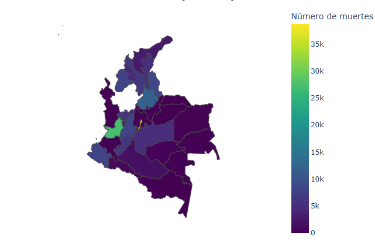
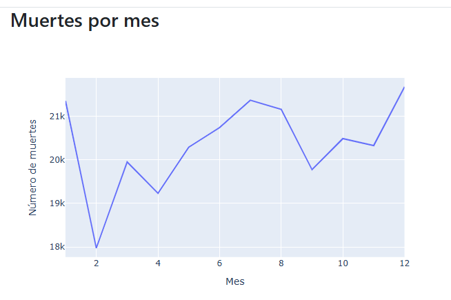
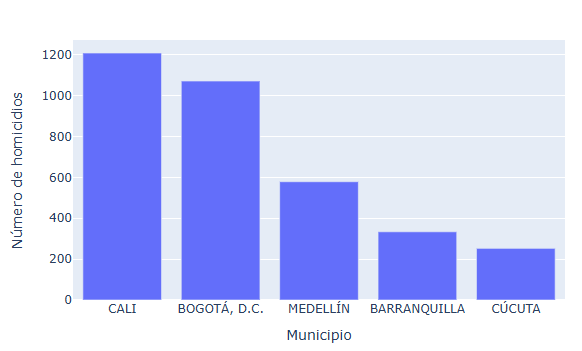
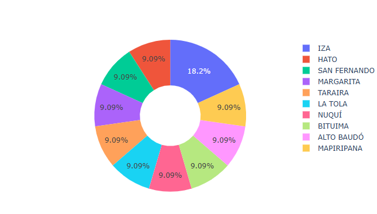
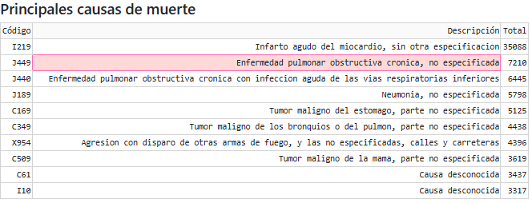
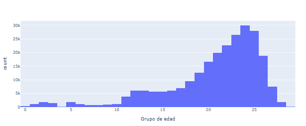
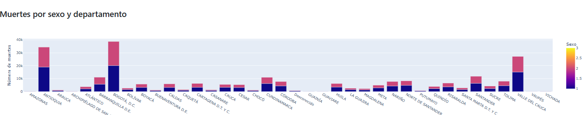

# **Informe: Análisis de Mortalidad en Colombia (2019)**  

**Nombre del estudiante:** Ivan Calderón, Luis Murcia  
**Asignatura:** Aplciaciones I  
**Fecha:** 2025-05-17  

- [Enlace Demo](http://54.198.21.249/)  

---

## **📌 Introducción**  

### **Descripción del Proyecto**  
Este proyecto consiste en una **aplicación web interactiva** desarrollada en Python con Dash y Plotly, diseñada para analizar y visualizar datos de mortalidad en Colombia durante el año 2019. La aplicación permite explorar patrones demográficos, regionales y temporales a través de gráficos dinámicos y tablas filtrables.  

### **Objetivos**  
1. Visualizar la distribución geográfica de la mortalidad por departamento.  
2. Identificar las principales causas de muerte y su frecuencia.  
3. Analizar tendencias mensuales y por grupos de edad.  
4. Comparar diferencias en mortalidad por género y región.  

### **Tecnologías Utilizadas**  
- **Python**: Lenguaje principal para el procesamiento de datos.  
- **Dash**: Framework para construir la interfaz web interactiva.  
- **Plotly**: Librería para generar gráficos dinámicos.  
- **Pandas**: Manipulación y limpieza de datos.  
- **AWS Elastic Beanstalk**: Despliegue en la nube (opcional).  

---

## **🛠 Desarrollo**  

### **Funcionamiento General de la Aplicación**  
La aplicación está estructurada en dos pestañas principales:  

1. **Resumen General**:  
   - Mapa de muertes por departamento.  
   - Gráfico de tendencia mensual.  
   - Top 5 ciudades con más homicidios.  
   - Top 10 ciudades con menor mortalidad.  

2. **Análisis Detallado**:  
   - Tabla de las 10 principales causas de muerte.  
   - Histograma de distribución por edad.  
   - Gráfico de barras apiladas por género y departamento.  

### **Explicación**  

#### **1. Pestaña "Resumen General"**  

 
📌 **Mapa de Distribución por Departamento**  


- **Propósito**: Mostrar concentración geográfica de muertes.  
- **Interacción**: El usuario puede pasar el cursor para ver cifras exactas por departamento.  

📌 **Gráfico de Líneas (Tendencia Mensual)**  

- **Propósito**: Identificar meses con mayor mortalidad.  

📌 **Gráfico de barras**  

- **Propósito**: Identificar ciudades con mayor mortalidad

📌 **Gráfico circular**  

- **Propósito**: Identificar  ciudades con menor mortalidad

---

#### **2. Pestaña "Análisis Detallado"**  
📌 **Tabla de Principales Causas de Muerte**  

- **Propósito**: Listar las enfermedades/eventos más letales.  

📌 **Histograma de Edades**  
grupos
- **Propósito**: Identificar grupos etarios más vulnerables.  
📌 **Gráfico de barras apiladas**  

- **Propósito**: Identificar muertes por sexo y departamento
---

## **📊 Visualización e Interpretación de Datos**  

### **Hallazgos Clave**  

#### **1. Distribución Geográfica**  
- **Departamentos con mayor mortalidad**: Bogotá, Antioquia y Valle del Cauca.  
- **Posible causa**: Alta densidad poblacional y problemas de seguridad en zonas urbanas.  

#### **2. Tendencia Mensual**  
- **Picos en diciembre y junio**: Podrían relacionarse con accidentes de tránsito en festividades.  

#### **3. Principales Causas de Muerte**  
1. **Enfermedades cardiovasculares** (Código I20-I25).  
2. **Homicidios** (X95-Y09).  
3. **Diabetes** (E10-E14).  

#### **4. Diferencias por Género**  
- **Hombres**: Mayor mortalidad por violencia (75% de los homicidios).  
- **Mujeres**: Mayor prevalencia de enfermedades crónicas.  

---
#### ** Despliegue de la Aplicación**  
- Clonación del repositorio o transferencia de archivos:  
  ```bash
  git clone [repositorio] || scp -i key.pem app.zip ubuntu@<IP_PÚBLICA>:/home/ubuntu
  ```  
- Configuración de Gunicorn y Nginx:  
  ```bash
  gunicorn --bind 0.0.0.0:8000 --timeout 120 app:server
  ```  
  - Archivo de configuración de Nginx (`/etc/nginx/sites-available/mortalidad-app`):  
    ```nginx
    server {
        listen 80;
        server_name <IP_PÚBLICA>;

        location / {
            proxy_pass http://127.0.0.1:8000;
            proxy_set_header Host $host;
        }
    }
    ```  

#### **4. Publicación Final**  
- Habilitar el sitio y reiniciar Nginx:  
  ```bash
  sudo ln -s /etc/nginx/sites-available/mortalidad-app /etc/nginx/sites-enabled/
  sudo systemctl restart nginx
  ```  

### **Enlace a la Aplicación**  
🔗 **URL de la aplicación**: [URL Análisis de Mortalidad](http://54.198.21.249/)  


---
## **✅ Conclusiones**  

1. **La mortalidad en Colombia (2019)** está concentrada en zonas urbanas y vinculada a violencia y enfermedades no transmisibles.  
2. **Dash y Plotly** demostraron ser herramientas eficaces para crear visualizaciones interactivas que facilitan el análisis.  
3. **Limitaciones**: Los datos dependen de la calidad del registro oficial (posibles subregistros en zonas rurales).  
4. **Futuras Mejoras**:  
   - Añadir filtros por año para análisis comparativo.  
   - Integrar datos socioeconómicos para cruzar variables.  

---

## **🔗 Recursos Adicionales**  
- [Repositorio del Proyecto](https://github.com/gityamil/mortalidad-colombia)  
- [Documentación de Dash](https://dash.plotly.com/)  

